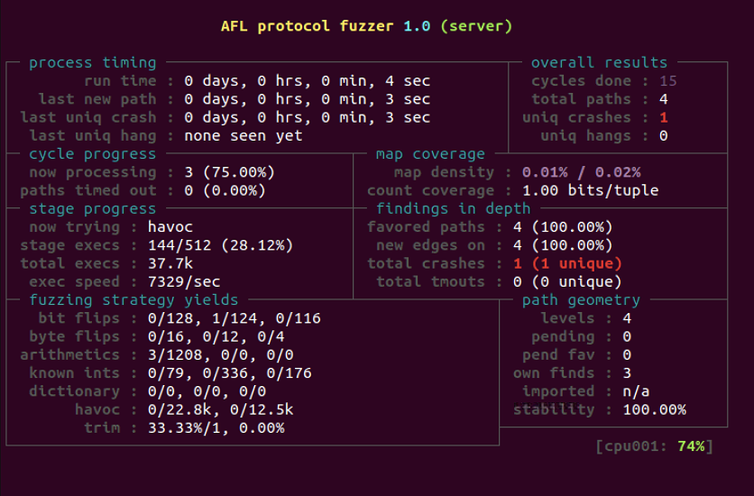
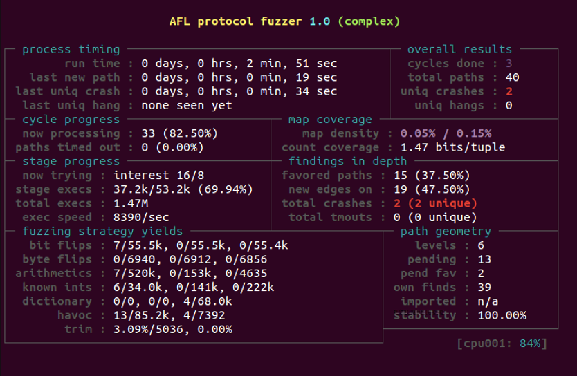

# Hermes

## Documents
- Slides: [Hermes](https://github.com/HarDToBelieve/Hermes/blob/master/slide.pdf)
- My bachelor thesis: [Hermes - A protocol fuzzer bassed on AFL](https://github.com/HarDToBelieve/Hermes/blob/master/main.pdf)
- Architecture: 

## Install dependencies
- Install `libpcap` for recording communication between server and client

```
$ sudo apt-get install libpcap-dev
```

## Build fuzzers
### Custom AFL
- Build custom AFL by entering the directory `afl-2.52b`

```
$ cd afl-2.52b
$ make
$ sudo make install
```

### AFL-Protocol fuzzer
- Build the protocol fuzzer

```
$ cd afl-protocol
$ make
```

## Test samples
### Simple echo server
- Build simple server and make input folder

```
$ cd sample/simple
$ CC=afl-gcc make
$ mkdir input_dir
```

- Record network traffics as initial input by running the interceptor. First, we start `server`

```
$ sample/simple/server 4000
Server is listening on 4000
```

Open another terminal, run interceptor

```
$ sudo afl-protocol/interceptor -m tcp -i 127.0.0.1 -p 4000 -d lo -o sample/simple/input_dir/input
```

Open another terminal, do the protocol as a client

```
$ nc localhost 4000
hello
hello
```

Wait a minute and then terminate the interceptor by hitting Ctrl-C. Now data has been recorded. Remember to drop privilege of input file

```
$ sudo chown user:user sample/simple/input_dir/input
```

- Start fuzzing with PAUSE/RESUME mechanism and unix socket to speed up 

```
$ cd afl-protocol
$ BIND_DIR=/tmp/ USE_SOCKFD=3 USE_SIGSTOP=1 ./afl-fuzz -i ../sample/simple/input_dir -o ../sample/simple/out -p 4000 -h ./libhook.so -t 10000  -- ../sample/simple/server 4000
```



## Complex chat room
- Build chat room server and make input folder

```
$ cd sample/complex
$ CC=afl-gcc make
$ mkdir input_dir
```

- Record network traffics as initial input by running the interceptor. First, we start `complex`

```
$ sample/complex/complex
<[ SERVER STARTED ]>
```

Open another terminal, run interceptor

```
$ sudo afl-protocol/interceptor -m tcp -i 127.0.0.1 -p 5000 -d lo -o sample/complex/input_dir/input
```

Open another terminal, do the protocol as a client

```
$ nc localhost 5000
<< 11 has joined
<< see /help for assistance
/help
<< /quit     Quit chatroom
<< /crash    Make the program crash
<< /ping     Server test
<< /topic    <message> Set chat topic
<< /nick     <name> Change nickname
<< /msg      <reference> <message> Send private message
<< /list     Show active clients
<< /help     Show help
```

Wait a minute and then terminate the interceptor by hitting Ctrl-C. Now data has been recorded. Remember to drop privilege of input file

```
$ sudo chown user:user sample/complex/input_dir/input
```

- Start fuzzing with PAUSE/RESUME mechanism and unix socket to speed up 

```
$ cd afl-protocol
$ BIND_DIR=/tmp/ USE_SOCKFD=3 USE_SIGSTOP=1 ./afl-fuzz -i ../sample/complex/in -o ../sample/complex/out -p 5000 -h ./libhook.so -t 10000  -- ../sample/complex/complex
```



## Run with Docker
Build it
```
docker build . -t fuzzer
```

Then run it
```
docker run fuzzer simple
docker run fuzzer complex
```
